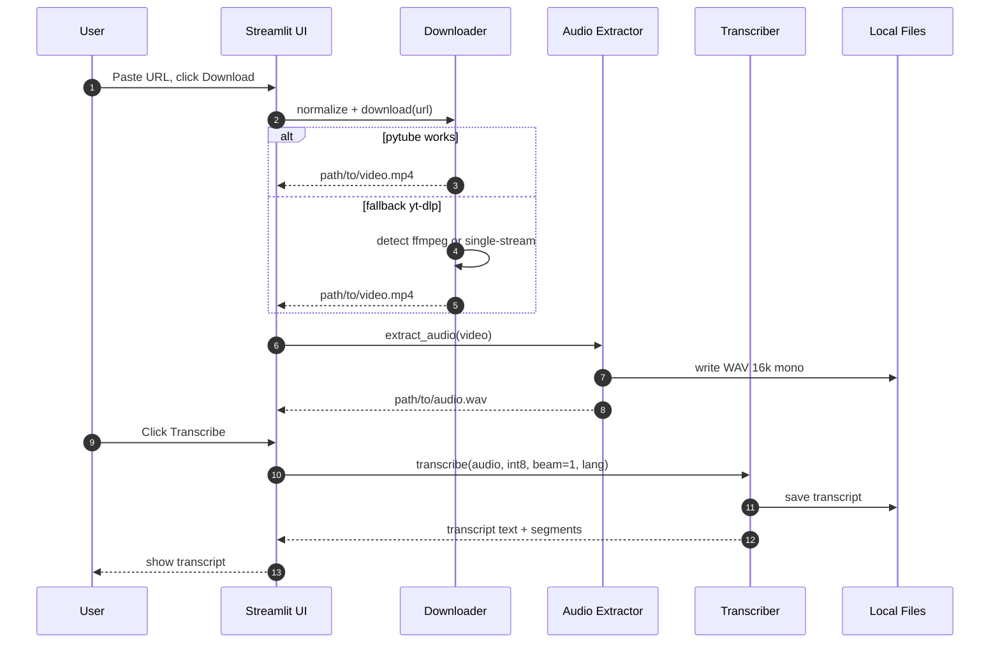
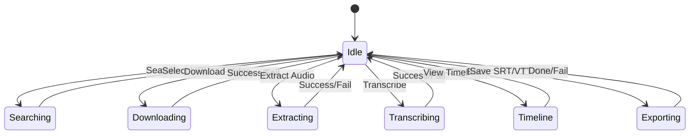
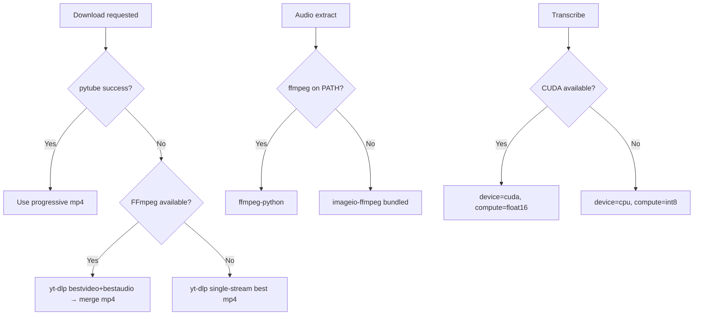
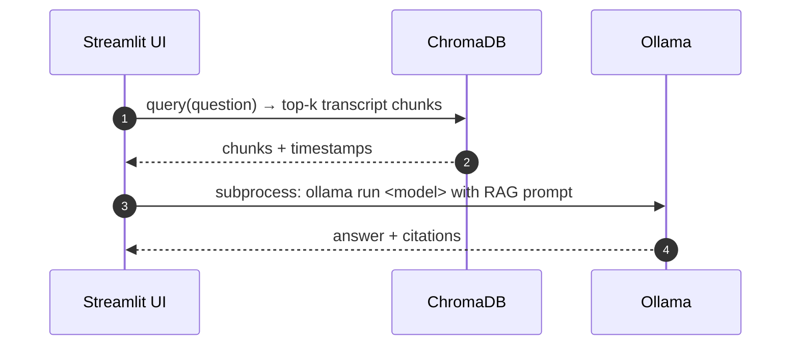

# FreeTube-Agent Architecture

This document describes what the project is, why it exists, how it runs, and how every part fits together. It is meant to be the single place you can read to understand the system end-to-end. All diagrams are rendered with Mermaid.

## Goals & Principles

- 100% local, free, and privacy-preserving
- Windows-friendly, simple setup (venv + `pip install -r requirements.txt`)
- Robust YouTube download that survives site changes
- CPU-first performance with optional GPU acceleration
- Clear UX: simple pipeline (Download → Extract → Transcribe) before advanced features

## Feature Overview

- Download videos (YouTube URL normalization; `pytube` with `yt-dlp` fallback)
- Extract audio to WAV (16 kHz mono) using system FFmpeg or bundled `imageio-ffmpeg`
- Transcribe locally with Faster-Whisper (CTranslate2 backend) — optimized for CPU by default
- Streamlit UI to run the pipeline and view outputs
- In-app search tab (youtube-search-python), Export tab (SRT/VTT)
- Planned: Q&A with Ollama, semantic search with ChromaDB, vision captions (BLIP2/CLIP), OCR (EasyOCR)

## Tech Stack (Pinned for compatibility)

- UI: `streamlit==1.38.0`, `streamlit-player==0.1.5`
- Download: `pytube==15.0.0`, `yt-dlp>=2024.10.22,<2026`
- Media: `ffmpeg-python==0.2.0`, `imageio-ffmpeg==0.4.9`
- Speech-to-text: `faster-whisper==1.0.2` (uses `ctranslate2==4.6.0`)
- Data/plots: `numpy==1.26.4`, `pandas==2.3.3`, `matplotlib==3.8.4`, `plotly==5.24.1`
- Planned: `chromadb`, `transformers`, `easyocr`, `torch` (CPU acceptable), `sentence-transformers`

## Directory Structure

```text
AI_Vedio_tool/
├─ README.md
├─ requirements.txt
├─ docs/
│  └─ architecture.md   ← This file
└─ src/
   └─ freetube_agent/
      ├─ __init__.py
      ├─ paths.py        ← Centralized data directories
      ├─ download.py     ← URL normalization + pytube/yt-dlp fallback
      ├─ audio.py        ← Audio extraction to WAV (ffmpeg or imageio-ffmpeg)
      ├─ transcribe.py   ← Faster-Whisper wrapper (CPU-friendly defaults)
      └─ ui/
         └─ app.py       ← Streamlit UI (download → extract → transcribe)

data/
├─ videos/       ← downloaded video files
├─ audio/        ← extracted WAV files
└─ transcripts/  ← plain text transcripts (.txt)
```

## Runtime Architecture

```mermaid
flowchart TD
  U[User] -->|browser| UI[Streamlit UI]
  subgraph App[Python App]
    UI --> DL[Downloader\n(pytube → yt-dlp fallback)]
    UI --> AU[Audio Extractor\n(ffmpeg / imageio-ffmpeg)]
    UI --> TR[Transcriber\n(faster-whisper/CTranslate2)]
    UI --> MEM[(Local Storage\ntranscripts, audio, video)]
    UI -->|planned| VIZ[Vision: BLIP2/CLIP]
    UI -->|planned| OCR[OCR: EasyOCR]
    UI -->|planned| VS[Vector Store\nChromaDB]
    UI -->|planned| LLM[Ollama Local LLM]
  end

  DL -->|MP4| VID[[data/videos]]
  AU -->|WAV 16k mono| AUD[[data/audio]]
  TR -->|TXT/segments| TXT[[data/transcripts]]
  VIZ -->|captions/embeds| VS
  OCR -->|text spans| VS
  TXT --> VS
  LLM --> UI
```

## Pipeline: Download → Extract → Transcribe



## UI Flow & State



- Sidebar controls:
  - Model size: tiny/base/small/medium/large-v3
  - Fast mode (CPU): int8 + beam size 1
  - Language (skip auto-detect)
  - VAD toggle (skip silence)
- Tabs: Search, Pipeline, Timeline, Export
- Session state keys: `video_path`, `audio_path`, `transcript_path`, `transcript_text`, `_segments` (start,end,text), `_words` (optional: seg,start,end,word)

## Components & Responsibilities

- download.py
  - `normalize_yt_url(url) -> str`
  - Tries `pytube` progressive MP4; on failure uses `yt-dlp`
  - FFmpeg detection: system `ffmpeg` or bundled `imageio-ffmpeg`; if absent, selects a single-stream format to avoid merge
- audio.py
  - Extract WAV 16 kHz mono
  - Prefer `ffmpeg-python`; fallback to `imageio-ffmpeg` executable
- transcribe.py
  - CPU-first defaults: `compute_type=int8`, `beam_size=1`
  - Auto device: CUDA if available, else CPU
  - Valid thread arguments to CTranslate2 (avoid None)
- paths.py
  - Centralized `data/` dirs creation and reuse
- ui/app.py
  - Orchestrates steps and presents results

## Error Handling & Fallbacks



## Performance Tuning

- Choose `tiny` model for quick checks; `base` for better quality
- Enable Fast mode (CPU): `int8`, `beam=1`
- Set Language (e.g., `en`) to skip auto-detect
- Enable VAD on long videos with silence
- GPU scenario: auto-switches to `cuda` + `float16`

## Ollama Integration (Planned)



- Detect `ollama` path: check PATH or allow manual path input
- Default model: `llama3.2` (adjustable to `phi3`, `mistral`)
- Prompt template: include user query + retrieved chunks with timestamps
- Privacy: all local; no external API calls

## Semantic Search with ChromaDB (Planned)

```mermaid
flowchart LR
  T[Transcript] --> C[Chunking (e.g., 512 tokens, 20% overlap)]
  C --> E[Embeddings (sentence-transformers)]
  E --> DB[(ChromaDB)]
  Q[User Query] --> EQ[Query Embedding]
  EQ --> DB
  DB --> R[Top-k chunks + metadata]
```

- Chunk metadata: start/end times, source file, segment ids
- Embeddings model: CPU-friendly (e.g., `all-MiniLM-L6-v2`) or local transformers
- Jump to time: UI links back to timestamps in the player

## Vision & OCR (Planned)

```mermaid
flowchart LR
  V[Video] --> S[Frame Sampling\n(e.g., 1 fps or scene cuts)]
  S --> CAP[BLIP2 captions]
  S --> OCR[EasyOCR text]
  CAP --> VS[(ChromaDB)]
  OCR --> VS
```

- Sampling strategies: fixed interval or scene change via `cv2`
- Captions: BLIP2/CLIP via `transformers` (CPU ok, slower)
- OCR: `easyocr` for text overlays, slides, charts

## Outputs & Formats

- Current: `.txt` transcript, stored in `data/transcripts/`
- Exports: `.srt` / `.vtt` caption files
- Exports (CSV): segments and words with timings
- Planned: JSON with segment timings, per-frame captions JSON

## Setup Summary

1) Create venv and install requirements (see README)
2) Optional: install system FFmpeg for better merges
3) Optional: prepare Ollama model `ollama pull llama3.2`
4) Run app: `streamlit run src/freetube_agent/ui/app.py`

## Security & Privacy

- 100% local. No cloud APIs.
- Model and video caches stored in user profile and project `data/` directories.

## Testing & Smoke Checks

- Try a known public URL (e.g., `https://youtu.be/dQw4w9WgXcQ`)
- Use `tiny` + Fast mode for quick validation
- Verify audio WAV in `data/audio/` and transcript in `data/transcripts/`

## Roadmap

- v0.1: Current pipeline + UI
- v0.2: Transcript export (SRT/VTT), in-app YouTube search
- v0.3: Ollama Q&A with ChromaDB RAG
- v0.4: Vision captions + OCR, vector fusion with transcript

## Known Limitations

- CPU-only systems will be slower; use Fast mode and smaller models
- Some YouTube links may require yt-dlp; we auto‑fallback and avoid merges when no FFmpeg
- Vision/OCR are CPU-capable but slow; enable on-demand

## Design Decisions

- Dual downloader (pytube → yt‑dlp)
  - Rationale: pytube is light but can break when YouTube changes; yt‑dlp is resilient and supports more formats.
  - Behavior: try pytube first for progressive MP4; if it fails, normalize URL and fall back to yt‑dlp.
- Bundled FFmpeg via imageio‑ffmpeg
  - Rationale: avoid admin/system installs; ensure audio extraction works everywhere.
  - Behavior: prefer system `ffmpeg` when present; otherwise use bundled binary. yt‑dlp avoids A/V merges if no FFmpeg.
- Faster‑Whisper (CTranslate2) over PyTorch Whisper
  - Rationale: faster on CPU, smaller runtime footprint, easy quantization (int8) for local use.
  - Defaults: CPU-first (compute_type=int8, beam_size=1), auto‑switch to CUDA with float16 when available.
- Streamlit for UI
  - Rationale: quick local UX, simple state, minimal boilerplate.
- Pinned dependencies
  - Rationale: stable, reproducible installs across Windows environments.
- Simple, inspectable data layout
  - Rationale: users can find videos/audio/transcripts without vendor lock‑in or DB setup.

## Module API Reference

- freetube_agent.paths
  - Constants: `DATA`, `VIDEOS`, `AUDIO`, `TRANSCRIPTS` (Path)
  - Side effects: ensures directories exist at import time

- freetube_agent.download
  - `normalize_yt_url(url: str) -> str`
    - Input: any YouTube URL (youtu.be, shorts, watch with playlists)
    - Output: canonical `https://www.youtube.com/watch?v=<id>` when possible
  - `download_youtube(url: str, output_dir: Optional[Path] = None) -> Path`
    - Output directory defaults to `paths.VIDEOS`
    - Returns: final downloaded file path
    - Exceptions: `RuntimeError` on failure (after both strategies)

- freetube_agent.audio
  - `extract_audio(video_path: str | Path, output_path: Optional[str | Path] = None) -> Path`
    - Output: WAV (16 kHz mono) path under `paths.AUDIO` by default
    - Uses system `ffmpeg` if available; else bundled `imageio-ffmpeg`

- freetube_agent.transcribe
  - Data classes:
    - `Segment(start: float, end: float, text: str)`
    - `Transcript(text: str, segments: list[Segment], path: Optional[Path] = None)`
  - `transcribe(audio_path, model_size='base', device=None, compute_type=None, beam_size=1, language='en', vad_filter=False, word_timestamps=False, condition_on_previous_text=False, temperature=0.0, cpu_threads=0, num_workers=1) -> Transcript`
    - Defaults chosen for CPU speed: int8, beam=1, English language
    - Auto device: CUDA if available, else CPU
  - `save_transcript(t: Transcript, video_stem: str, output_dir: Optional[Path] = None) -> Path`
    - Writes `video_stem.txt` under `paths.TRANSCRIPTS` by default and updates `t.path`

- freetube_agent.ui.app
  - Streamlit app orchestrating the pipeline
  - Uses `st.session_state` keys: `video_path`, `audio_path`, `transcript_path`, `transcript_text`

## Troubleshooting

- yt‑dlp error: “ffmpeg is not installed… merging multiple formats”
  - Cause: yt‑dlp chose separate best audio+video which requires FFmpeg.
  - Fix: The app now detects FFmpeg automatically; if none, it selects a single progressive stream to avoid merging. Optionally install system FFmpeg for best quality.
- Pytube HTTP 400 or signature issues
  - Use the same URL again; app normalizes and falls back to yt‑dlp automatically.
- “ffmpeg” not found during audio extraction
  - The app falls back to `imageio-ffmpeg` binary. Optional: install FFmpeg and ensure it’s on PATH for faster merges.
- Transcription very slow
  - Enable Fast mode (default): int8 quantization, beam=1; use `tiny` model; set Language to `en`; enable VAD for long silences.
- Transcription error: incompatible constructor arguments (cpu_threads)
  - Fixed: we always pass `cpu_threads=0` (integer). If you see this, ensure you’re running the updated code.
- CUDA/GPU not used
  - No NVIDIA GPU present; runs on CPU by design. If you add one, we’ll auto‑use CUDA and `float16` for speed.
- Port already in use (8501)
  - Run: `streamlit run src/freetube_agent/ui/app.py --server.port 8502`
- Ollama not found
  - Add Ollama directory to PATH or configure full path in settings (planned). Test with `ollama run llama3.2`.
- Chocolatey install prompts or permission errors
  - Use an elevated PowerShell (Run as Administrator), or manually install FFmpeg by downloading a zip and adding `bin` to PATH.
