# FreeTube-Agent Architecture

This document describes what the project is, why it exists, how it runs, and how every part fits together. It is meant to be the single place you can read to understand the system end-to-end. All diagrams are rendered with Mermaid.

## Goals & Principles

- 100% local, free, and privacy-preserving
- Windows-friendly, simple setup (venv + `pip install -r requirements.txt`)
- Robust YouTube download that survives site changes
- CPU-first performance with optional GPU acceleration
- Clear UX: simple pipeline (Download → Extract → Transcribe) before advanced features

## Feature Overview

### Core Pipeline (Implemented)
- **Download videos**: YouTube URL normalization; `pytube` with `yt-dlp` fallback
- **Extract audio**: WAV (16 kHz mono) using system FFmpeg or bundled `imageio-ffmpeg`
- **Transcribe**: Locally with Faster-Whisper (CTranslate2 backend) — optimized for CPU by default
- **YouTube-inspired UI**: Modern dark theme with card-based layout and view routing

### Advanced Features (✅ Implemented - Nov 2025)
- **✅ Semantic Search**: ChromaDB integration with vector embeddings and auto-indexing
- **✅ Settings Persistence**: JSON-based config system with export/import
- **✅ Video Player Sync**: Interactive player with clickable timestamps and segment navigation
- **✅ Enhanced Library**: Advanced search, filtering, sorting, tags, ratings, dual views
- **✅ Error Handling**: Comprehensive logging, error tracking, retry mechanisms
- **✅ AI Summarization**: Local LLM via Ollama (multiple summary styles)
- **✅ Advanced Export**: 7+ formats (PDF, Word, Markdown, JSON, Blog HTML, SRT, VTT)
- **✅ Analytics Dashboard**: Library statistics, word frequency analysis, activity tracking
- **✅ In-app Search**: YouTube search integration (youtube-search-python)
- **✅ Q&A System**: RAG-based question answering with semantic retrieval

### Planned Enhancements
- **Vision Captions**: BLIP2/CLIP for frame-based image understanding
- **OCR**: EasyOCR for text extraction from video frames
- **Batch Processing**: Queue-based multi-video processing

## Tech Stack (Pinned for compatibility)

### Core Dependencies
- **UI**: `streamlit==1.38.0`, `streamlit-player==0.1.5`
- **Download**: `pytube==15.0.0`, `yt-dlp>=2024.10.22,<2026`
- **Media**: `ffmpeg-python==0.2.0`, `imageio-ffmpeg==0.4.9`
- **Speech-to-text**: `faster-whisper==1.0.2` (uses `ctranslate2==4.6.0`)
- **Data/plots**: `numpy==1.26.4`, `pandas==2.3.3`, `matplotlib==3.8.4`, `plotly==5.24.1`

### Advanced Features (Implemented - Nov 2025)
- **LLM Integration**: Ollama (local, via subprocess)
- **Document Export**: `reportlab==4.2.2`, `python-docx==1.1.2`
- **Visualizations**: `wordcloud==1.9.3`
- **Search**: `youtube-search-python`
- **Semantic Search**: `chromadb==0.5.5`, `sentence-transformers==3.1.0`
- **Error Tracking**: Built-in logging and error handling system

### Planned
- `transformers`, `easyocr`, `torch` (for vision/OCR features)

## Directory Structure

```text
AI_Vedio_tool/
├─ README.md
├─ requirements.txt
├─ INSTALL_NEW_FEATURES.md   ← Quick install guide for new features
├─ RUN_NEW_UI.md             ← Guide for YouTube-inspired UI
├─ docs/
│  ├─ architecture.md         ← This file (comprehensive system documentation)
│  └─ PROGRESS.md             ← Development progress tracking
└─ src/
   └─ freetube_agent/
      ├─ __init__.py
      ├─ paths.py              ← Centralized data directories
      ├─ download.py           ← URL normalization + pytube/yt-dlp fallback
      ├─ audio.py              ← Audio extraction to WAV (ffmpeg or imageio-ffmpeg)
      ├─ transcribe.py         ← Faster-Whisper wrapper (CPU-friendly defaults)
      ├─ search.py             ← YouTube search integration
      ├─ export.py             ← Basic export (SRT/VTT)
      ├─ export_advanced.py    ← Advanced export (PDF/Word/Markdown/JSON/HTML)
      ├─ summarize.py          ← AI summarization with Ollama
      ├─ analytics.py          ← Statistics and insights
      ├─ rag.py                ← RAG chunking, ChromaDB indexing, semantic retrieval
      ├─ llm.py                ← Ollama subprocess wrapper
      ├─ config.py             ← ✨ NEW: Settings persistence (JSON config)
      ├─ player.py             ← ✨ NEW: Video player utilities & timestamp sync
      ├─ library.py            ← ✨ NEW: Library management (search/filter/sort/tags)
      ├─ logger.py             ← ✨ NEW: Logging, error tracking, retry mechanisms
      └─ ui/
         ├─ app.py             ← YouTube-inspired UI (multi-view, enhanced)
         ├─ app_old_backup.py  ← Original simple UI (backup)
         └─ styles/
            └─ youtube.css     ← Custom dark theme CSS

data/
├─ videos/       ← downloaded video files (.mp4)
├─ audio/        ← extracted WAV files (16kHz mono)
├─ transcripts/  ← plain text transcripts (.txt)
├─ chroma/       ← ✨ NEW: ChromaDB vector database
├─ metadata/     ← ✨ NEW: Video metadata (tags, ratings, notes)
├─ logs/         ← ✨ NEW: Application logs (main, errors, performance)
└─ config.json   ← ✨ NEW: User settings (auto-saved)
```

## Runtime Architecture (Updated Nov 2025)


## Complete Data Flow Diagram

```mermaid
flowchart TB
  subgraph Input["📥 Input Sources"]
    URL[YouTube URL]
    QUERY[Search Query]
    FILE[Local Video]
  end

  subgraph Search["🔍 Search Flow"]
    QUERY --> YSEARCH[YouTube Search]
    YSEARCH --> RESULTS[Video Results]
    RESULTS --> URL
  end

  subgraph Core["⚙️ Core Processing Pipeline"]
    URL --> NORM[URL Normalization]
    NORM --> DL_PYTUBE{Try pytube}
    DL_PYTUBE -->|Success| VID_FILE[(Video File<br/>data/videos/*.mp4)]
    DL_PYTUBE -->|Fail| DL_YTDLP[yt-dlp Fallback]
    DL_YTDLP --> FFMPEG_CHECK{FFmpeg<br/>Available?}
    FFMPEG_CHECK -->|Yes| MERGE[Merge Best A+V]
    FFMPEG_CHECK -->|No| SINGLE[Single Stream]
    MERGE --> VID_FILE
    SINGLE --> VID_FILE
    
    VID_FILE --> EXTRACT[Audio Extraction]
    EXTRACT --> AUDIO_FILE[(Audio File<br/>data/audio/*.wav<br/>16kHz mono)]
    
    AUDIO_FILE --> WHISPER[Faster-Whisper<br/>Transcription]
    WHISPER --> TRANS_FILE[(Transcript<br/>data/transcripts/*.txt)]
    WHISPER --> SEGMENTS[Segment Data<br/>start, end, text]
  end

  subgraph Advanced["🚀 Advanced Features"]
    TRANS_FILE --> CHUNK[RAG Chunking<br/>200 words, 20% overlap]
    CHUNK --> CHUNKS_DATA[Chunks + Timestamps]
    
    TRANS_FILE --> SUMMARIZE[AI Summarization]
    SUMMARIZE --> OLLAMA1[Ollama LLM]
    OLLAMA1 --> SUMMARY[Summary<br/>overview, key points, topics]
    
    CHUNKS_DATA --> QA_RETRIEVE[Keyword Retrieval]
    QA_USER[User Question] --> QA_RETRIEVE
    QA_RETRIEVE --> QA_CONTEXT[Top-k Chunks]
    QA_CONTEXT --> OLLAMA2[Ollama LLM]
    OLLAMA2 --> QA_ANSWER[Answer + Citations]
    
    TRANS_FILE --> ANA_FREQ[Word Frequency]
    ANA_FREQ --> WORDCLOUD[Word Cloud]
    TRANS_FILE --> ANA_STATS[Library Stats]
    VID_FILE --> ANA_STATS
    AUDIO_FILE --> ANA_STATS
    ANA_STATS --> DASHBOARD[Analytics Dashboard]
    
    TRANS_FILE --> EXP_ENGINE[Export Engine]
    SEGMENTS --> EXP_ENGINE
    EXP_ENGINE --> PDF[📄 PDF]
    EXP_ENGINE --> WORD[📝 Word]
    EXP_ENGINE --> MD[📋 Markdown]
    EXP_ENGINE --> JSON[🔧 JSON]
    EXP_ENGINE --> HTML[🌐 HTML]
    EXP_ENGINE --> SRT[🎬 SRT/VTT]
  end

  subgraph UI_LAYER["🖥️ User Interface (YouTube-Inspired)"]
    HOME[Home View<br/>Dashboard]
    SEARCH_VIEW[Search View<br/>Video Grid]
    PROCESS_VIEW[Process View<br/>Pipeline Steps]
    LIBRARY_VIEW[Library View<br/>All Videos]
    TRANSCRIPT_VIEW[Transcript View<br/>Multi-tab]
    ANALYTICS_VIEW[Analytics View<br/>Stats & Insights]
    SETTINGS_VIEW[Settings View<br/>Configuration]
  end

  subgraph Storage["💾 Persistent Storage"]
    VID_FILE
    AUDIO_FILE
    TRANS_FILE
    SUMMARY --> EXPORT_FILES[(Export Files)]
    PDF --> EXPORT_FILES
    WORD --> EXPORT_FILES
    MD --> EXPORT_FILES
  end

  RESULTS --> SEARCH_VIEW
  URL --> PROCESS_VIEW
  TRANS_FILE --> TRANSCRIPT_VIEW
  SUMMARY --> TRANSCRIPT_VIEW
  QA_ANSWER --> TRANSCRIPT_VIEW
  DASHBOARD --> ANALYTICS_VIEW
  WORDCLOUD --> ANALYTICS_VIEW
  EXPORT_FILES --> TRANSCRIPT_VIEW

  style Input fill:#2d3748,stroke:#4299e1,stroke-width:2px
  style Search fill:#2d3748,stroke:#48bb78,stroke-width:2px
  style Core fill:#2d3748,stroke:#ed8936,stroke-width:2px
  style Advanced fill:#2d3748,stroke:#9f7aea,stroke-width:2px
  style UI_LAYER fill:#2d3748,stroke:#f56565,stroke-width:2px
  style Storage fill:#2d3748,stroke:#38b2ac,stroke-width:2px
```



## Pipeline: Download → Extract → Transcribe


## Sequence Diagram: AI Summarization


## Sequence Diagram: RAG-based Q&A


## Sequence Diagram: Advanced Export


## Sequence Diagram: Analytics Dashboard

```mermaid
sequenceDiagram
  autonumber
  participant User
  participant UI as Streamlit UI
  participant ANA as Analytics
  participant FS as Local Files

  User->>UI: Click "📊 Analytics" button
  UI->>ANA: get_library_stats()
  ANA->>FS: Scan data/videos, data/audio, data/transcripts
  ANA->>ANA: Calculate file counts, sizes, word counts
  ANA-->>UI: Library statistics dict
  
  UI->>ANA: get_processing_activity()
  ANA->>FS: Read file modification times
  ANA->>ANA: Group by date, calculate trends
  ANA-->>UI: Activity timeline data
  
  UI->>ANA: analyze_word_frequency(transcripts)
  ANA->>FS: Read all transcript files
  ANA->>ANA: Tokenize, count, filter stopwords
  ANA->>ANA: Generate word cloud data
  ANA-->>UI: Top words + frequencies
  
  UI-->>User: Display dashboard with:
  Note over UI: - Storage metrics (videos/audio/transcripts)<br/>- Processing activity charts<br/>- Word frequency visualizations<br/>- File listings with metadata
```



## Sequence Diagram: YouTube Search


## ✨ Sequence Diagram: Semantic Search with Auto-Indexing (NEW)


## ✨ Sequence Diagram: Settings Persistence (NEW)

```mermaid
sequenceDiagram
  autonumber
  participant User
  participant UI as Streamlit UI
  participant CFG as Config Manager
  participant FS as File System

  Note over User,FS: App Startup - Load Config
  User->>UI: Launch app
  UI->>CFG: get_config_manager()
  CFG->>FS: Read config.json
  alt Config exists
    FS-->>CFG: Configuration data
    CFG->>CFG: Parse JSON → dataclasses
  else Config missing
    CFG->>CFG: Create default config
  end
  CFG-->>UI: AppConfig object
  UI->>UI: Initialize session_state from config
  UI-->>User: Show UI with saved preferences

  Note over User,FS: User Changes Setting
  User->>UI: Change setting (e.g., model size)
  UI->>CFG: update_transcription(model_size="small")
  CFG->>CFG: Update config object
  CFG->>FS: Write config.json (auto-save)
  FS-->>CFG: Success
  CFG-->>UI: Setting saved
  UI-->>User: Updated (no manual save needed)

  Note over User,FS: Export/Import Config
  User->>UI: Click "Export Config"
  UI->>CFG: export_config(path)
  CFG->>FS: Write backup JSON
  FS-->>UI: Download link
  UI-->>User: Download config file
  
  User->>UI: Upload config file
  UI->>CFG: import_config(uploaded_path)
  CFG->>FS: Read uploaded JSON
  FS-->>CFG: Config data
  CFG->>CFG: Validate and apply
  CFG->>FS: Save as current config
  UI-->>User: ✅ Settings imported & reloaded
```



## ✨ Sequence Diagram: Video Player + Transcript Sync (NEW)

```mermaid
sequenceDiagram
  autonumber
  participant User
  participant UI as Streamlit UI
  participant PLAYER as Player Module
  participant FS as File System

  Note over User,FS: View Transcript with Video
  User->>UI: Select transcript from Library
  UI->>FS: Check if video exists
  FS-->>UI: video_path.exists() = True
  UI->>UI: Show "Player" tab (not just "Transcript")
  UI->>FS: Load transcript with segments
  FS-->>UI: Transcript(text, segments)
  
  UI->>PLAYER: prepare segments for display
  PLAYER->>PLAYER: Create segment dicts with start/end/text
  PLAYER-->>UI: Segment list
  
  UI-->>User: Display video player + interactive transcript
  Note over UI: Side-by-side: Video left, Transcript right

  Note over User,FS: Click Timestamp to Jump
  User->>UI: Click segment timestamp [00:42]
  UI->>PLAYER: parse_timestamp("00:42")
  PLAYER-->>UI: 42.0 seconds
  UI->>UI: Update session_state.current_time
  UI->>PLAYER: find_current_segment(42.0, segments)
  PLAYER-->>UI: segment_index = 5
  UI-->>User: Highlight segment #5 (gold background)
  Note over User: Manual video seek to 00:42

  Note over User,FS: Navigate Segments
  User->>UI: Click "Next Segment ⏭️"
  UI->>PLAYER: Get next segment start time
  PLAYER-->>UI: start = 54.3 seconds
  UI->>UI: Update current_time = 54.3
  UI-->>User: Jump to segment #6 (highlight + video seek)
```



## ✨ Sequence Diagram: Enhanced Library Management (NEW)


## ✨ Sequence Diagram: Error Handling & Logging (NEW)

```mermaid
sequenceDiagram
  autonumber
  participant User
  participant UI as Streamlit UI
  participant MODULE as Any Module
  participant LOG as Logger
  participant ERR as Error Tracker
  participant FS as File System

  Note over User,FS: Function with Retry Mechanism
  User->>UI: Click "Download Video"
  UI->>MODULE: @retry(max_attempts=3) download_youtube(url)
  MODULE->>MODULE: Attempt 1: Execute download
  MODULE-->>MODULE: ❌ ConnectionError
  MODULE->>LOG: logger.warning("Attempt 1/3 failed, retrying...")
  LOG->>FS: Write to freetube_agent.log
  
  MODULE->>MODULE: Wait 1 second
  MODULE->>MODULE: Attempt 2: Execute download
  MODULE-->>MODULE: ✅ Success
  MODULE->>LOG: logger.info("Download completed")
  LOG->>FS: Write to freetube_agent.log
  MODULE-->>UI: video_path
  UI-->>User: ✅ Video downloaded

  Note over User,FS: Critical Error with Tracking
  User->>UI: Click "Transcribe"
  UI->>MODULE: transcribe(audio_path)
  MODULE-->>MODULE: ❌ RuntimeError: Model load failed
  MODULE->>LOG: logger.error("Transcription failed: {error}")
  LOG->>FS: Write to errors.log (ERROR level)
  
  MODULE->>ERR: error_tracker.log_error(exception)
  ERR->>ERR: Create error entry with context
  ERR->>FS: Append to error_tracker.json
  
  MODULE->>MODULE: get_user_friendly_error(exception)
  MODULE-->>UI: "Model file not found. Please reinstall."
  UI-->>User: User-friendly error message
  
  Note over User,FS: Performance Logging
  UI->>MODULE: with perf_logger.measure("transcribe"): transcribe()
  MODULE->>MODULE: Start timer
  MODULE->>MODULE: Execute transcription (45.3 seconds)
  MODULE->>LOG: perf_logger.log_metric("transcribe", 45.3, success=True)
  LOG->>FS: Append to performance.log
  MODULE-->>UI: Transcript
  
  Note over User,FS: View Error Logs in Settings
  User->>UI: Navigate to Settings → Logs
  UI->>ERR: error_tracker.get_recent_errors(10)
  ERR->>FS: Read error_tracker.json
  FS-->>ERR: Last 10 errors
  ERR-->>UI: Error list with timestamps
  UI-->>User: Display error history
```



## ✨ Sequence Diagram: Log Viewer UI (NEW)

```mermaid
sequenceDiagram
  autonumber
  participant User
  participant UI as Streamlit UI
  participant ERR as Error Tracker
  participant PERF as Performance Logger
  participant FS as File System (data/logs/)

  Note over User,FS: Tab 1: Recent Errors View
  User->>UI: Navigate to Settings → Logs → Recent Errors
  UI->>ERR: error_tracker.get_recent_errors(10)
  ERR->>FS: Read error_tracker.json
  FS-->>ERR: Last 1000 errors (JSON array)
  ERR-->>UI: Last 10 errors with full context
  UI->>ERR: error_tracker.get_error_summary()
  ERR-->>UI: {total: 45, by_type: {...}, by_module: {...}}
  UI-->>User: Display error metrics + expandable error list
  
  User->>UI: Click error expander
  UI-->>User: Show: module, function, context, message, traceback
  
  Note over User,FS: Tab 2: Performance Metrics View
  User->>UI: Navigate to Logs → Performance Metrics
  UI->>FS: Read performance.log (last 20 lines)
  FS-->>UI: JSON lines with operation metrics
  UI->>UI: Group by operation & calculate averages
  UI-->>User: Display per-operation stats (calls, avg duration, success rate)
  
  User->>UI: Expand "Recent Performance Entries"
  UI-->>User: Show last 10 operations with timestamps
  
  Note over User,FS: Tab 3: All Logs View
  User->>UI: Navigate to Logs → All Logs
  User->>UI: Select "Error Log", Lines: 50
  UI->>FS: Read errors.log (last 50 lines)
  FS-->>UI: Log content
  UI-->>User: Display in text area
  
  User->>UI: Click "Download Error Log"
  UI->>UI: Prepare log content as file
  UI-->>User: Trigger browser download
  
  User->>UI: Click "Clear All Logs"
  UI-->>User: Show confirmation warning
  User->>UI: Click again to confirm
  UI->>FS: Delete *.log and *.json in LOG_DIR
  FS-->>UI: Files deleted
  UI-->>User: ✅ Success message + page refresh
```



## UI Flow & State (YouTube-Inspired Multi-View Architecture)


### UI Views & Navigation

**Top Navigation Bar**
- 🏠 Home button (always visible)
- 📊 Analytics button
- ⚙️ Settings button
- Global YouTube-style search bar

**Views**
1. **Home Dashboard**: Stats cards, quick actions, recent videos
2. **Search Results**: Grid of video cards with thumbnails
3. **Video Processor**: Step-by-step pipeline with progress
4. **Library Manager**: List/grid of all processed videos
5. **Transcript Viewer**: Multi-tab interface for single video
   - 📄 Transcript tab: Full text with timestamps
   - ⏱️ Timeline tab: Visual timeline with segments
   - 🤖 AI Summary tab: Generate and view summaries
   - 💬 Q&A tab: Chat-style RAG interface
   - 📤 Export tab: Multi-format export options
6. **Analytics Dashboard**: 3 tabs (Activity, Words, Files)
7. **Settings Panel**: Model config, paths, preferences

**Session State Keys** (Enhanced)
- Navigation: `current_view`, `selected_video_id`
- Pipeline: `video_path`, `audio_path`, `transcript_path`, `transcript_text`
- Segments: `_segments` (list of Segment objects), `_words` (optional word-level)
- Library: `library_videos`, `selected_transcript`
- Search: `search_results`, `search_query`
- Analytics: `analytics_data`, `word_cloud_data`
- Settings: `model_size`, `language`, `fast_mode`, `vad_filter`, `ollama_model`

## Components & Responsibilities

### Core Pipeline Modules

**download.py**
- `normalize_yt_url(url) -> str`: Converts various YouTube URL formats to canonical form
- `download_youtube(url, output_dir) -> Path`: Downloads video with dual strategy
  - Primary: `pytube` for progressive MP4 (fast, simple)
  - Fallback: `yt-dlp` with FFmpeg detection
  - Smart format selection: avoids merge if no FFmpeg

**audio.py**
- `extract_audio(video_path, output_path) -> Path`: Extracts audio to WAV 16 kHz mono
  - Prefers `ffmpeg-python` for system FFmpeg
  - Falls back to `imageio-ffmpeg` bundled executable
  - Consistent output format for transcription

**transcribe.py**
- `transcribe(audio_path, model_size, device, ...) -> Transcript`: Faster-Whisper wrapper
  - CPU-first defaults: `compute_type=int8`, `beam_size=1`
  - Auto device detection: CUDA if available, else CPU
  - Returns: `Transcript` dataclass with text and `Segment` list
- `save_transcript(transcript, video_stem, output_dir) -> Path`: Saves to `.txt` file

**paths.py**
- Centralized constants: `DATA`, `VIDEOS`, `AUDIO`, `TRANSCRIPTS` (Path objects)
- Auto-creates directories on import
- Single source of truth for file locations

### Advanced Feature Modules (New)

**search.py**
- `search_youtube(query, max_results) -> List[Dict]`: YouTube search integration
  - Uses `youtube-search-python` library
  - Returns: title, url, thumbnail, duration, views, channel
  - No API key required (scraping-based)

**summarize.py**
- `generate_summary(transcript, model, ollama_path, style) -> Dict`: AI summarization
  - Styles: comprehensive, brief, academic, casual
  - Ollama integration via subprocess
  - Returns structured summary: overview, key points, topics, takeaways
- `generate_key_points(transcript, ...) -> List[str]`: Extract bullet points
- `generate_title_suggestions(transcript, ...) -> List[str]`: Auto-generate titles

**rag.py** ✨ Enhanced with Semantic Search
- `chunk_transcript(transcript, max_words, overlap_words) -> List[Dict]`: Chunking for RAG
  - Groups segments into word-bounded chunks
  - Configurable overlap for context preservation
  - Returns chunks with id, text, start, end timestamps
- `build_index(name, transcript) -> int`: ✨ NEW - Build ChromaDB index
  - Creates vector embeddings using sentence-transformers
  - Stores in persistent ChromaDB collection
  - Returns chunk count
- `query_index(name, query, top_k) -> List[Dict]`: ✨ NEW - Semantic search
  - Generates query embedding
  - Performs cosine similarity search
  - Returns top-k most relevant chunks
- `is_indexed(name) -> bool`: ✨ NEW - Check index status
- `get_indexed_videos() -> List[str]`: ✨ NEW - List all indexed videos
- `batch_index_all(force_reindex) -> Dict`: ✨ NEW - Index entire library

**llm.py**
- `run_ollama(prompt, model, ollama_path) -> str`: Subprocess wrapper for Ollama
  - Detects ollama executable (PATH or custom path)
  - Runs as subprocess, streams output
  - Error handling for missing Ollama

**analytics.py**
- `get_library_stats() -> Dict`: Comprehensive library statistics
  - File counts: videos, audio, transcripts
  - Storage usage by category
  - Total word count across transcripts
- `get_processing_activity() -> Dict`: Activity timeline
  - Files processed by date
  - Trends and patterns
- `analyze_word_frequency(transcript_paths) -> Dict`: Text analysis
  - Word frequency counting
  - Stopword filtering
  - Word cloud data generation
- `get_file_details(path) -> Dict`: Metadata extraction

**export.py** (Basic)
- `export_srt(transcript, output_path) -> Path`: Subtitle format
- `export_vtt(transcript, output_path) -> Path`: WebVTT format

**export_advanced.py** (New)
- `export_to_pdf(transcript, metadata, output_path) -> bytes`: Professional PDF
  - Uses `reportlab` for layout
  - Table of contents, styled sections, timestamps
- `export_to_word(transcript, metadata, output_path) -> bytes`: Editable DOCX
  - Uses `python-docx`
  - Headings, styles, formatting
- `export_to_markdown(transcript, metadata) -> str`: Developer-friendly format
- `export_to_json(transcript, metadata) -> str`: Structured data
- `export_to_blog_html(transcript, metadata) -> str`: Styled HTML article
  - Responsive design, syntax highlighting ready
  - Embeddable in websites

### ✨ New Enhanced Modules (Nov 2025)

**config.py** - Settings Persistence System
- `ConfigManager` class: Manages all application settings
  - `load()`: Load config from JSON or create defaults
  - `save()`: Auto-save config to file
  - `update_transcription(**kwargs)`: Update transcription settings
  - `update_semantic_search(**kwargs)`: Update search settings
  - `update_llm(**kwargs)`: Update LLM settings
  - `update_ui(**kwargs)`: Update UI preferences
  - `export_config(path)`: Export configuration
  - `import_config(path)`: Import configuration
  - `reset_to_defaults()`: Reset all settings
- Dataclasses: `TranscriptionConfig`, `SemanticSearchConfig`, `LLMConfig`, `UIConfig`
- JSON-based storage: `data/config.json`
- Auto-save on every change
- No manual save button needed

**player.py** - Video Player & Transcript Sync
- `format_timestamp(seconds) -> str`: Convert seconds to HH:MM:SS
- `parse_timestamp(timestamp_str) -> float`: Parse timestamp to seconds
- `find_current_segment(time, segments) -> int`: Find segment at time
- `create_clickable_transcript(segments, current_idx) -> str`: HTML transcript
- `create_segment_navigation(segments, current_idx) -> str`: Navigation buttons
- `extract_timestamps_from_text(text) -> List[Tuple]`: Parse timestamps from text
- Supports multiple formats: HH:MM:SS, MM:SS, SS
- Session state tracking for current playback time
- Visual highlighting of active segments

**library.py** - Enhanced Library Management
- `LibraryItem` class: Represents video with metadata
  - Properties: `has_video`, `has_audio`, `has_transcript`, `is_complete`
  - File sizes: `video_size_mb`, `audio_size_mb`, `total_size_mb`
  - Dates: `created_date`, `modified_date`
  - Tags: `add_tag()`, `remove_tag()`, `tags` property
  - Rating: `set_rating(0-5)`, `rating` property
  - Notes: `set_notes()`, `notes` property
  - Metadata persistence: Auto-save to `data/metadata/{stem}.json`
- `get_all_library_items() -> List[LibraryItem]`: Scan entire library
- `search_library(query, items) -> List`: Search by name/tags/content
- `filter_library(items, **criteria) -> List`: Multi-criteria filtering
- `sort_library(items, sort_by, reverse) -> List`: 8 sort options
- `get_all_tags() -> List[str]`: Get all unique tags
- `delete_library_item(item) -> Dict`: Delete with selective file removal

**logger.py** - Error Handling & Logging System (412 lines)
- `setup_logger(name, level) -> Logger`: Configure comprehensive logging
  - Console handler with colored output (Green/Yellow/Red by level)
  - Main file handler: `data/logs/freetube_agent.log` (DEBUG+)
  - Error file handler: `data/logs/errors.log` (ERROR+ only)
  - Performance file handler: `data/logs/performance.log` (JSON metrics)
  - Automatic log directory creation
  - UTF-8 encoding support
  - Formatted timestamps and module/function context
- `ErrorTracker` class: Track and analyze errors
  - `log_error(error, context, module, function, user_message)`: Log with full context
    - Stores error type, message, timestamp, traceback
    - Module and function information
    - User-friendly error message
    - Context about what was being attempted
  - `get_recent_errors(count)`: Get recent error history (last N errors)
  - `get_error_summary()`: Statistics by type and module
    - Total error count
    - Breakdown by error type
    - Breakdown by module
  - JSON persistence: `logs/error_tracker.json` (stores last 1000 errors)
  - Automatic file creation and management
- `@retry(max_attempts, delay, backoff, exceptions)`: Decorator for automatic retries
  - Exponential backoff algorithm
  - Configurable exception types to catch
  - Logs each retry attempt with delay information
  - Final error logged on exhaustion
  - Used in: `download_youtube()`, `_download_with_ytdlp()`, `extract_audio()`
- `PerformanceLogger` class: Track operation performance
  - `log_metric(operation, duration, success, details)`: Log performance data
    - Operation name
    - Duration in seconds
    - Success/failure status
    - Optional additional details dict
  - `measure(operation)`: Context manager for timing operations
    - Automatic start/stop timing
    - Success detection (exception = failure)
  - JSON line-based storage: `logs/performance.log`
- `get_user_friendly_error(error) -> str`: Convert technical errors to readable messages
  - Maps common exceptions to user-friendly explanations
  - Provides actionable troubleshooting steps
  - Returns helpful guidance for end users
- `safe_execute(func, default_return, error_message)`: Execute function with error handling
  - Returns default value on error
  - Optionally logs the error
  - Useful for optional operations
- `log_function_call(func)`: Decorator to log function calls and timing
  - Logs function entry and exit
  - Records execution duration
  - Logs success or failure
  - Integrated with PerformanceLogger
- `clear_old_logs(days)`: Cleanup old log files
  - Deletes logs older than specified days
  - Logs cleanup operation
- **Global instances**: `logger`, `error_tracker`, `perf_logger` available for import
- **Integrated in 7 modules**: download.py, transcribe.py, audio.py, rag.py, llm.py, summarize.py, app.py

### UI Module

**ui/app.py** (YouTube-Inspired)
- Multi-view architecture with view routing
- Views: Home, Search, Process, Library, TranscriptView, Analytics, Settings
- Custom CSS (`styles/youtube.css`) for dark theme
- Session state management for navigation and data
- Integration with all backend modules
- Real-time progress indicators and status updates

## Error Handling & Fallbacks


## Performance Tuning

- Choose `tiny` model for quick checks; `base` for better quality
- Enable Fast mode (CPU): `int8`, `beam=1`
- Set Language (e.g., `en`) to skip auto-detect
- Enable VAD on long videos with silence
- GPU scenario: auto-switches to `cuda` + `float16`

## Ollama Integration (✅ Implemented)

The system now integrates local LLMs via Ollama for AI-powered features.

### Features Using Ollama

**1. AI Summarization** (summarize.py)
- Multiple summary styles: comprehensive, brief, academic, casual
- Structured output: overview, key points, topics, audience, takeaways
- Title and key point generation

**2. RAG-based Q&A** (via rag.py + llm.py)
- Transcript chunking with configurable word limits and overlap
- Keyword-based retrieval (vector search planned)
- Context-aware answers with timestamp citations
- Chat-style interface in UI

### Implementation Details

**Subprocess Integration** (llm.py)
```python
def run_ollama(prompt: str, model: str = "llama3.2", 
               ollama_path: Optional[str] = None) -> str:
    # Detect ollama executable from PATH or custom path
    # Run as subprocess: ollama run <model>
    # Stream output and return complete response
```

**Path Detection**
- Checks system PATH for `ollama` or `ollama.exe`
- Allows manual path configuration in settings
- Graceful fallback with clear error messages

**Model Configuration**
- Default: `llama3.2` (balanced performance/quality)
- Alternatives: `llama3.2:1b` (faster), `mistral`, `phi3`
- User-selectable in Settings panel

**Prompt Engineering**
- Summary prompts: structured output with clear sections
- RAG prompts: include relevant chunks with timestamps
- Temperature control for deterministic vs creative outputs

**Privacy & Performance**
- 100% local execution (no API calls)
- Subprocess isolation (non-blocking UI)
- Timeout handling for long generations
- Progress indicators in UI

## Semantic Search with ChromaDB (Planned)

```mermaid
flowchart LR
  T[Transcript] --> C[Chunking (e.g., 512 tokens, 20% overlap)]
  C --> E[Embeddings (sentence-transformers)]
  E --> DB[(ChromaDB)]
  Q[User Query] --> EQ[Query Embedding]
  EQ --> DB
  DB --> R[Top-k chunks + metadata]
```

- Chunk metadata: start/end times, source file, segment ids
- Embeddings model: CPU-friendly (e.g., `all-MiniLM-L6-v2`) or local transformers
- Jump to time: UI links back to timestamps in the player

## Vision & OCR (Planned)

```mermaid
flowchart LR
  V[Video] --> S[Frame Sampling\n(e.g., 1 fps or scene cuts)]
  S --> CAP[BLIP2 captions]
  S --> OCR[EasyOCR text]
  CAP --> VS[(ChromaDB)]
  OCR --> VS
```

- Sampling strategies: fixed interval or scene change via `cv2`
- Captions: BLIP2/CLIP via `transformers` (CPU ok, slower)
- OCR: `easyocr` for text overlays, slides, charts

## Outputs & Formats

- Current: `.txt` transcript, stored in `data/transcripts/`
- Exports: `.srt` / `.vtt` caption files
- Exports (CSV): segments and words with timings
- Planned: JSON with segment timings, per-frame captions JSON

## Setup Summary

1) Create venv and install requirements (see README)
2) Optional: install system FFmpeg for better merges
3) Optional: prepare Ollama model `ollama pull llama3.2`
4) Run app: `streamlit run src/freetube_agent/ui/app.py`

## Security & Privacy

- 100% local. No cloud APIs.
- Model and video caches stored in user profile and project `data/` directories.

## Testing & Smoke Checks

- Try a known public URL (e.g., `https://youtu.be/dQw4w9WgXcQ`)
- Use `tiny` + Fast mode for quick validation
- Verify audio WAV in `data/audio/` and transcript in `data/transcripts/`

## Roadmap

### ✅ Completed (v0.1 - v0.3)
- **v0.1**: Core pipeline (Download → Extract → Transcribe)
- **v0.2**: 
  - ✅ Basic exports (SRT/VTT)
  - ✅ In-app YouTube search
  - ✅ YouTube-inspired UI redesign
- **v0.3**: 
  - ✅ Ollama integration (AI summarization)
  - ✅ RAG-based Q&A (keyword retrieval)
  - ✅ Advanced exports (PDF, Word, Markdown, JSON, HTML)
  - ✅ Analytics dashboard
  - ✅ Library management

### 🔄 In Progress (v0.4)
- **Semantic Search**: ChromaDB integration for vector-based retrieval
  - Replace keyword matching with embeddings (sentence-transformers)
  - Cosine similarity search for better Q&A accuracy
  - Persistent vector store for library-wide search

### 📅 Planned (v0.5+)
- **v0.5**: Vision & OCR
  - Frame sampling (fixed interval or scene detection)
  - BLIP2/CLIP for image captioning
  - EasyOCR for text extraction from frames
  - Vector fusion of transcripts + captions + OCR text
- **v0.6**: Enhanced Features
  - Multi-language UI support
  - Batch processing (process multiple videos)
  - Custom model fine-tuning support
  - Export to presentation formats (PPTX)
- **v0.7**: Collaboration & Sharing
  - Export to Notion, Obsidian formats
  - Video timestamp-based notes
  - Collaborative annotations

## Known Limitations

- CPU-only systems will be slower; use Fast mode and smaller models
- Some YouTube links may require yt-dlp; we auto‑fallback and avoid merges when no FFmpeg
- Vision/OCR are CPU-capable but slow; enable on-demand

## Design Decisions

- Dual downloader (pytube → yt‑dlp)
  - Rationale: pytube is light but can break when YouTube changes; yt‑dlp is resilient and supports more formats.
  - Behavior: try pytube first for progressive MP4; if it fails, normalize URL and fall back to yt‑dlp.
- Bundled FFmpeg via imageio‑ffmpeg
  - Rationale: avoid admin/system installs; ensure audio extraction works everywhere.
  - Behavior: prefer system `ffmpeg` when present; otherwise use bundled binary. yt‑dlp avoids A/V merges if no FFmpeg.
- Faster‑Whisper (CTranslate2) over PyTorch Whisper
  - Rationale: faster on CPU, smaller runtime footprint, easy quantization (int8) for local use.
  - Defaults: CPU-first (compute_type=int8, beam_size=1), auto‑switch to CUDA with float16 when available.
- Streamlit for UI
  - Rationale: quick local UX, simple state, minimal boilerplate.
- Pinned dependencies
  - Rationale: stable, reproducible installs across Windows environments.
- Simple, inspectable data layout
  - Rationale: users can find videos/audio/transcripts without vendor lock‑in or DB setup.

## Module API Reference

### Core Modules

**freetube_agent.paths**
- Constants: `DATA`, `VIDEOS`, `AUDIO`, `TRANSCRIPTS` (Path)
- Side effects: ensures directories exist at import time

**freetube_agent.download**
- `normalize_yt_url(url: str) -> str`
  - Input: any YouTube URL (youtu.be, shorts, watch with playlists)
  - Output: canonical `https://www.youtube.com/watch?v=<id>` when possible
- `download_youtube(url: str, output_dir: Optional[Path] = None) -> Path`
  - Output directory defaults to `paths.VIDEOS`
  - Returns: final downloaded file path
  - Exceptions: `RuntimeError` on failure (after both strategies)

**freetube_agent.audio**
- `extract_audio(video_path: str | Path, output_path: Optional[str | Path] = None) -> Path`
  - Output: WAV (16 kHz mono) path under `paths.AUDIO` by default
  - Uses system `ffmpeg` if available; else bundled `imageio-ffmpeg`

**freetube_agent.transcribe**
- Data classes:
  - `Segment(start: float, end: float, text: str)`
  - `Transcript(text: str, segments: list[Segment], path: Optional[Path] = None)`
- `transcribe(audio_path, model_size='base', device=None, compute_type=None, beam_size=1, language='en', vad_filter=False, word_timestamps=False, condition_on_previous_text=False, temperature=0.0, cpu_threads=0, num_workers=1) -> Transcript`
  - Defaults chosen for CPU speed: int8, beam=1, English language
  - Auto device: CUDA if available, else CPU
- `save_transcript(t: Transcript, video_stem: str, output_dir: Optional[Path] = None) -> Path`
  - Writes `video_stem.txt` under `paths.TRANSCRIPTS` by default and updates `t.path`

### Advanced Feature Modules

**freetube_agent.search**
- `search_youtube(query: str, max_results: int = 10) -> List[Dict[str, Any]]`
  - Uses youtube-search-python for scraping-based search
  - Returns list of dicts with: title, url, thumbnail, duration, views, channel
  - No API key required

**freetube_agent.summarize**
- `generate_summary(transcript: Transcript, model: str = "llama3.2", ollama_path: Optional[str] = None, style: str = "comprehensive") -> Dict[str, Any]`
  - Styles: "comprehensive", "brief", "academic", "casual"
  - Returns dict with: overview, key_points, topics, audience, takeaways
- `generate_key_points(transcript: Transcript, count: int = 5, model: str = "llama3.2", ollama_path: Optional[str] = None) -> List[str]`
  - Extracts bullet points from transcript
- `generate_title_suggestions(transcript: Transcript, count: int = 3, model: str = "llama3.2", ollama_path: Optional[str] = None) -> List[str]`
  - Auto-generates title suggestions

**freetube_agent.rag**
- `chunk_transcript(transcript: Transcript, max_words: int = 200, overlap_words: int = 40) -> List[Dict[str, Any]]`
  - Returns list of dicts with: id, text, start, end
  - Groups segments with configurable overlap
- `retrieve_relevant_chunks(question: str, chunks: List[Dict], top_k: int = 3) -> List[Dict[str, Any]]`
  - Current: keyword-based matching
  - Returns top-k chunks with metadata

**freetube_agent.llm**
- `run_ollama(prompt: str, model: str = "llama3.2", ollama_path: Optional[str] = None) -> str`
  - Subprocess wrapper for Ollama
  - Auto-detects ollama executable from PATH
  - Returns generated text
  - Exceptions: `RuntimeError` if Ollama not found

**freetube_agent.analytics**
- `get_library_stats() -> Dict[str, Any]`
  - Returns: video_count, audio_count, transcript_count, total_size_mb, total_words, etc.
- `get_processing_activity(days: int = 30) -> Dict[str, Any]`
  - Returns activity timeline grouped by date
- `analyze_word_frequency(transcript_paths: List[Path], top_n: int = 50) -> Dict[str, Any]`
  - Returns: word_counts, top_words, stopwords_filtered
- `generate_word_cloud_data(transcript_paths: List[Path]) -> Dict[str, int]`
  - Returns word frequency dict for visualization
- `get_file_details(path: Path) -> Dict[str, Any]`
  - Returns: size, created, modified, extension

**freetube_agent.export**
- `export_srt(transcript: Transcript, output_path: Path) -> Path`
  - SubRip subtitle format
- `export_vtt(transcript: Transcript, output_path: Path) -> Path`
  - WebVTT subtitle format

**freetube_agent.export_advanced**
- `export_to_pdf(transcript: Transcript, metadata: Dict[str, Any], output_path: Optional[Path] = None) -> bytes`
  - Professional PDF with reportlab
  - Includes: TOC, headers, timestamps, styled sections
- `export_to_word(transcript: Transcript, metadata: Dict[str, Any], output_path: Optional[Path] = None) -> bytes`
  - Microsoft Word DOCX format
  - Includes: headings, styles, formatting
- `export_to_markdown(transcript: Transcript, metadata: Dict[str, Any]) -> str`
  - GitHub-flavored Markdown
  - Includes: frontmatter, timestamps as links
- `export_to_json(transcript: Transcript, metadata: Dict[str, Any]) -> str`
  - Structured JSON with segments
- `export_to_blog_html(transcript: Transcript, metadata: Dict[str, Any]) -> str`
  - Responsive HTML article
  - Includes: CSS, semantic markup, embeddable

### UI Module

**freetube_agent.ui.app**
- Multi-view Streamlit application
- Views: Home, Search, Process, Library, TranscriptView, Analytics, Settings
- Session state keys:
  - Navigation: `current_view`, `selected_video_id`
  - Pipeline: `video_path`, `audio_path`, `transcript_path`, `transcript_text`, `_segments`, `_words`
  - Search: `search_results`, `search_query`
  - Analytics: `analytics_data`, `word_cloud_data`
  - Settings: `model_size`, `language`, `fast_mode`, `vad_filter`, `ollama_model`

## Troubleshooting

### Core Pipeline Issues

**yt‑dlp error: "ffmpeg is not installed… merging multiple formats"**
- **Cause**: yt‑dlp chose separate best audio+video which requires FFmpeg
- **Fix**: The app now detects FFmpeg automatically; if none, it selects a single progressive stream to avoid merging. Optionally install system FFmpeg for best quality

**Pytube HTTP 400 or signature issues**
- **Cause**: YouTube API changes breaking pytube
- **Fix**: Use the same URL again; app normalizes and falls back to yt‑dlp automatically

**"ffmpeg" not found during audio extraction**
- **Cause**: No system FFmpeg installed
- **Fix**: The app falls back to `imageio-ffmpeg` binary. Optional: install FFmpeg and ensure it's on PATH for faster merges

**Transcription very slow**
- **Fix**: Enable Fast mode (default): int8 quantization, beam=1; use `tiny` model; set Language to `en`; enable VAD for long silences

**Transcription error: incompatible constructor arguments (cpu_threads)**
- **Fix**: We always pass `cpu_threads=0` (integer). If you see this, ensure you're running the updated code

**CUDA/GPU not used**
- **Cause**: No NVIDIA GPU present
- **Fix**: Runs on CPU by design. If you add GPU, we'll auto‑use CUDA and `float16` for speed

### New Features Issues

**Ollama not found / AI features not working**
- **Cause**: Ollama not installed or not in PATH
- **Fix**: 
  1. Install Ollama from https://ollama.ai
  2. Run `ollama pull llama3.2` to download the model
  3. Test with `ollama run llama3.2`
  4. If still not found, add Ollama directory to PATH or configure full path in Settings

### ✨ New Features Troubleshooting (Nov 2025)

**Semantic Search not working / "sentence-transformers not installed"**
- **Cause**: Missing dependencies or ChromaDB not initialized
- **Fix**: 
  1. Ensure `chromadb`, `sentence-transformers`, and `torch` are installed
  2. Check `requirements.txt` and run `pip install -r requirements.txt`
  3. Try manually indexing: Click "Index Transcript" in Q&A view
  4. Check logs in `data/logs/` for specific errors

**Settings not persisting / Reset after restart**
- **Cause**: Config file write permissions or corrupted JSON
- **Fix**:
  1. Check if `data/config.json` exists and is writable
  2. Try "Reset to Defaults" in Settings → Configuration Management
  3. Export your config, delete `data/config.json`, restart app, then import config

**Video player not showing transcript sync**
- **Cause**: Video file not found or transcript missing segments
- **Fix**:
  1. Ensure video file exists in `data/videos/`
  2. Transcript must have been generated (not manually created)
  3. Check that `_segments` are in session state (re-transcribe if needed)

**Library search not finding videos**
- **Cause**: Metadata not loaded or content indexing issue
- **Fix**:
  1. Search looks in: filename, tags, notes, transcript content
  2. Try exact filename first to verify item exists
  3. Check if transcript files are readable (not empty or corrupted)
  4. Tags must be added via Library → Tags button (stored in `data/metadata/`)

**Error logs not saving**
- **Cause**: Permissions issue in `data/logs/` directory
- **Fix**:
  1. Check if `data/logs/` directory exists and is writable
  2. On Windows: Run as administrator if needed
  3. Manually create `data/logs/` directory
  4. Check disk space

**ChromaDB errors / Index corruption**
- **Cause**: ChromaDB version mismatch or corrupted database
- **Fix**:
  1. Delete `data/chroma/` directory and rebuild indexes
  2. Use Settings → Semantic Search → "Clear All Indexes"
  3. Reinstall: `pip uninstall chromadb && pip install chromadb==0.5.5`
  4. Rebuild indexes with "Batch Index All" in Library

---

## ✨ New Features Summary (Nov 2025 Update)

### What's New

This major update adds 5 comprehensive feature sets and 4 new modules, transforming FreeTube-Agent into a production-ready video library management and semantic search system.

#### 1. Semantic Search with ChromaDB
- **Auto-indexing**: Automatically builds vector index after transcription
- **Batch operations**: Index entire library with one click
- **Semantic retrieval**: Find relevant content by meaning, not just keywords
- **Index management**: Check status, rebuild, or clear indexes
- **Settings integration**: Configure chunk size and overlap
- **Files**: Enhanced `rag.py` with 6 new functions

#### 2. Settings Persistence System
- **JSON config**: All settings saved to `data/config.json`
- **Auto-save**: No manual save button needed
- **Categorized**: Transcription, Semantic Search, LLM, UI settings
- **Export/Import**: Share configs between machines
- **Reset**: One-click reset to defaults
- **Files**: New `config.py` module (230 lines)

#### 3. Video Player + Transcript Sync
- **Side-by-side**: Video player + interactive transcript
- **Clickable timestamps**: Click any time to jump in video
- **Segment navigation**: Previous/Next buttons
- **Visual highlighting**: Gold background for current segment
- **Manual time jump**: Enter timestamp to seek
- **Multiple formats**: Supports HH:MM:SS, MM:SS, SS
- **Files**: New `player.py` module (250 lines)

#### 4. Enhanced Library Management
- **Advanced search**: By name, tags, notes, or transcript content
- **8 sort options**: Name, date, size, rating (ascending/descending)
- **Multi-criteria filters**: Complete, has video/audio/transcript, min rating, tags
- **Tag system**: Add/remove custom tags, filter by tags
- **Rating system**: 0-5 star ratings with visual display
- **Dual views**: List (detailed) or Grid (compact)
- **Metadata persistence**: JSON storage per video
- **Batch operations**: Mass index, filter, sort
- **Files**: New `library.py` module (400 lines)

#### 5. Error Handling & Logging System
- **Comprehensive logging**: Main log, error log, performance log (3 separate files)
- **Colored console**: Green/Yellow/Red level indicators for easy visual scanning
- **Error tracking**: JSON history with full context (stores last 1000 errors)
- **Retry mechanism**: Automatic retries with exponential backoff for network operations
- **Performance tracking**: Time all operations with success/failure metrics
- **User-friendly errors**: Convert technical errors to readable messages
- **Log cleanup**: Manual clear logs functionality via Settings
- **Log Viewer UI**: Interactive 3-tab interface in Settings view
  - **Recent Errors Tab**: Last 10 errors with full details, tracebacks, and context
  - **Performance Metrics Tab**: Grouped by operation, average duration, success rates
  - **All Logs Tab**: View/download any log file, configurable line count (10-500)
- **Integrated Across Codebase**: 7 modules enhanced with logging
  - `download.py`: 15+ logging calls, retry decorators, error tracking
  - `transcribe.py`: 10+ logging calls, performance metrics, error tracking
  - `audio.py`: Retry decorator, 8+ logging calls, dual-path logging
  - `rag.py`: 8+ logging calls, query performance metrics
  - `llm.py`: Complete rewrite with comprehensive logging, timeout handling
  - `summarize.py`: Error tracking and context for all summary operations
  - `app.py`: 155-line log viewer section in Settings
- **Files**: New `logger.py` module (412 lines), enhanced 7 modules (~470 total lines)

### Impact Metrics (Final v0.4 Stats)
- **+2,000 lines** of production code (8,273 insertions in final commit)
- **+4 new modules** (config, player, library, logger - already existed but now enhanced)
- **7 modules enhanced** with comprehensive logging
- **+32 features** implemented across 5 major tasks
- **+13 new files** created (7 modules + 6 documentation files)
- **+5 new data directories** (chroma, metadata, logs, config.json, error_tracker.json)
- **7 UI views** enhanced (Home, Search, Process, Library, Transcript, Q&A, Settings + Logs, Analytics)
- **4 log files** automatically managed (main, errors, performance, error_tracker)
- **100% local** - still no external dependencies or cloud services

### Backward Compatibility
- ✅ All existing features work unchanged
- ✅ Old data (videos/audio/transcripts) fully compatible
- ✅ No breaking changes to API
- ✅ Optional features - disable auto-indexing if needed
- ✅ Graceful degradation - works without ChromaDB

---

**Last Updated**: November 7, 2025 (Final v0.4 Release)  
**Version**: 0.4 - Production Ready  
**Status**: ✅ All 5 Major Tasks Complete (32+ Features Implemented)  
**Commit**: `d2898de` - Major feature release with comprehensive logging system

**Version History**:
- **v0.4** (Nov 7, 2025): Tasks 1-5 complete - Semantic Search, Settings, Player Sync, Library Management, Error Handling & Logging
- **v0.3** (Nov 2025): AI Summarization, Advanced Export, Analytics Dashboard
- **v0.2** (Oct 2025): YouTube-inspired UI, In-app Search
- **v0.1** (Initial): Core pipeline (Download → Extract → Transcribe)

**Summarization times out or fails**
- **Cause**: LLM model too large or slow
- **Fix**: 
  1. Use smaller model: `llama3.2:1b` instead of `llama3.2`
  2. Check Ollama is running: `ollama list`
  3. Try regenerating after a moment

**Q&A answers are not relevant**
- **Cause**: Keyword-based retrieval has limitations
- **Fix**: 
  1. Use more specific questions with keywords from transcript
  2. Wait for v0.4 semantic search (ChromaDB) for better retrieval

**Export to PDF fails**
- **Cause**: Missing reportlab dependency
- **Fix**: Run `pip install reportlab==4.2.2`

**Export to Word fails**
- **Cause**: Missing python-docx dependency
- **Fix**: Run `pip install python-docx==1.1.2`

**Analytics dashboard empty or incorrect**
- **Cause**: No processed videos or corrupted files
- **Fix**: 
  1. Process at least one video first
  2. Check `data/` directory has videos/audio/transcripts
  3. Verify file permissions

**YouTube search returns no results**
- **Cause**: Internet connection issue or YouTube blocking
- **Fix**: 
  1. Check internet connection
  2. Try different search terms
  3. Wait a moment and retry (rate limiting)

**Word cloud not generating**
- **Cause**: Missing wordcloud dependency
- **Fix**: Run `pip install wordcloud==1.9.3`

### UI Issues

**Port already in use (8501)**
- **Fix**: Run: `streamlit run src/freetube_agent/ui/app.py --server.port 8502`

**CSS not loading / Layout broken**
- **Cause**: Browser cache or file missing
- **Fix**: 
  1. Clear browser cache (Ctrl+Shift+R)
  2. Check `src/freetube_agent/ui/styles/youtube.css` exists
  3. Restart Streamlit server

**View navigation not working**
- **Cause**: Session state corruption
- **Fix**: Refresh the page (F5) or restart the app

**Video player not showing**
- **Cause**: streamlit-player not installed
- **Fix**: Run `pip install streamlit-player==0.1.5`

### System Issues

**Chocolatey install prompts or permission errors**
- **Fix**: Use an elevated PowerShell (Run as Administrator), or manually install FFmpeg by downloading a zip and adding `bin` to PATH

**Import errors after updating**
- **Cause**: Old dependencies cached
- **Fix**: 
  1. Deactivate and reactivate venv
  2. Run `pip install -r requirements.txt --upgrade --force-reinstall`

**Memory errors during processing**
- **Cause**: Large video file or insufficient RAM
- **Fix**: 
  1. Use smaller Whisper model (`tiny` or `base`)
  2. Close other applications
  3. Process shorter videos
